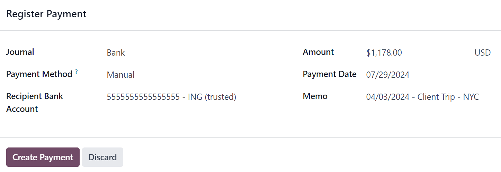
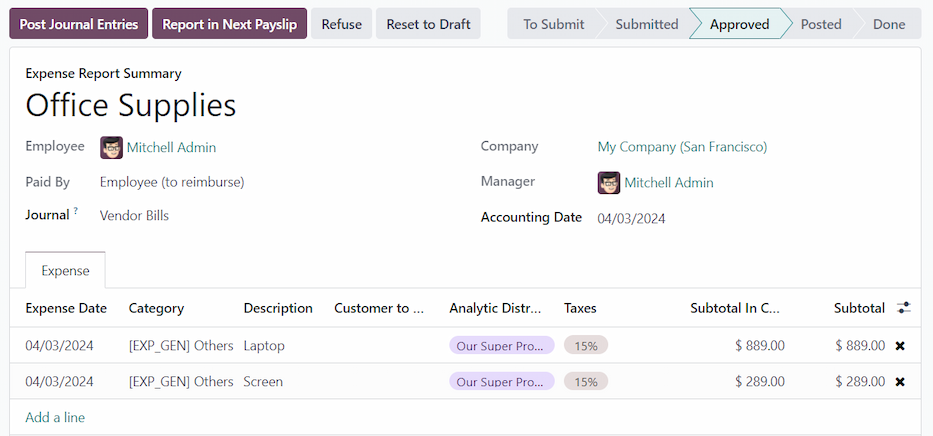

===================
Reimburse employees
===================

After an expense report is :doc:`posted to an accounting journal <../expenses/post_expenses>`, the
next step is to reimburse the employee. Just like approving and posting expenses, employees can be
reimbursed in two ways: either with cash, check, or direct deposit (:ref:`individually
<expenses/reimburse-single>` or :ref:`in bulk <expenses/reimburse-bulk>`), or :ref:`reimbursed in a
payslip <expenses/reimburse-payslip>`.

Settings
========

Reimbursements can be paid via paycheck, check, cash, or bank transfer. To set up payment options,
first configure the various settings by navigating to :menuselection:`Expenses app -->
Configuration --> Settings`.

To reimburse employees for expenses :ref:`in their paychecks <expenses/reimburse-payslip>`, activate
the :guilabel:`Reimburse in Payslip` option in the :guilabel:`Expenses` section.

Next, set how payments are made in the :guilabel:`Accounting` section. Click the drop-down menu
under :guilabel:`Payment Methods`, and select the desired payment option. Default options include
paying by :guilabel:`Cash`, :guilabel:`Check`, :guilabel:`NACHA`, and others. Leaving this field
blank allows for **all** available payment options to be used.

.. _expenses/reimburse-single:

Reimburse individually
======================

To reimburse an individual expense report, first navigate to :menuselection:`Expenses app -->
Expense Reports --> Reports To Pay`. All expense reports are presented in a default list view.
Click on the expense report being reimbursed to view the report details.

.. important::
   **ONLY** expense reports with a status of :guilabel:`Posted` can be reimbursed.

Click the :guilabel:`Register Payment` button in the top-left corner of the expense report, and a
:guilabel:`Register Payment` pop-up window appears. Enter the following information in the pop-up
window:

- :guilabel:`Journal`: Select the accounting journal to post the payment to using the drop-down
  menu.
- :guilabel:`Payment Method`: Select how the payment is made using the drop-down menu. The default
  options are :guilabel:`Manual`, :guilabel:`Checks`, and :guilabel:`NACHA`.
- :guilabel:`Recipient Bank Account`: Select the employee's bank account that the payment is being
  sent to. If the employee has a bank account on file in the :ref:`Private Information tab
  <employees/private-info>` of the **Employees** app, that bank account populates this field, by
  default.
- :guilabel:`Amount`: The total amount being reimbursed populates this field, by default. The
  currency, located to the right of the amount field, can be modified using the drop-down menu.
- :guilabel:`Payment Date`: Enter the date the payments are issued. The current date populates this
  field by default.
- :guilabel:`Memo`: The text entered in the :doc:`Expense Report Summary
  <../expenses/expense_reports>` field of the expense report populates this field, by default.

         reimbursement.

When the form is completed, click the :guilabel:`Create Payment` button to register the payment, and
reimburse the employee.

.. _expenses/reimburse-bulk:

Reimburse in bulk
=================

To reimburse multiple expense reports at once, navigate to :menuselection:`Expenses app --> Expense
Reports --> Reports To Pay` to view all expense reports in a list view. Next, adjust the
:guilabel:`STATUS` filters on the far-left side to only present expense reports with a status of
:guilabel:`POSTED`.

.. tip::
   Adjusting the :guilabel:`STATUS` filters to only show :guilabel:`POSTED` expense reports is not
   necessary, but removes the step of selecting each individual report in the list.

Tick the checkbox next to :guilabel:`Employee` to select all the reports in the list. Once ticked,
the number of selected expense reports appears on a :guilabel:`(#) Selected` button in the
top-center of the screen. Additionally, a :guilabel:`Register Payment` smart button also appears, on
the left-hand side.

.. image:: reimburse/multiple-reports.png
   :align: center
   :alt: Expense reports filtered by the status Posted, making the Register Payment button visible.

Click the :guilabel:`Register Payment` button, and a :guilabel:`Register Payment` pop-up window
appears. Enter the following information in the pop-up window:

- :guilabel:`Journal`: Select the accounting journal to post the payment to, using the drop-down
  menu.
- :guilabel:`Payment Method`: Select how the payment is made using the drop-down menu. The default
  options are :guilabel:`Manual`, :guilabel:`Checks`, and :guilabel:`NACHA`.
- :guilabel:`Group Payments`: If multiple expense reports are selected for the same employee, this
  option appears. Tick the checkbox to have only *one* payment made per employee, rather than
  issuing multiple payments to the same employee.
- :guilabel:`Payment Date`: Enter the date the payments are issued. The current date populates this
  field by default.

.. image:: reimburse/register.png
   :align: center
   :alt: The Register Payment pop-up window filled out.

When the form is completed, click the :guilabel:`Create Payments` button to register the payments,
and reimburse the employees.

.. _expenses/reimburse-payslip:

Report in next payslip
======================

If the option to reimburse employees in their payslips is activated in the :guilabel:`Expenses`
section, payments can be added to their next payslip, instead of issued manually.

.. important::
   Reimbursing expenses on payslips can **only** be done individually, on an expense report with a
   status of :guilabel:`Approved`. Once an expense report has a status of :guilabel:`Posted`, the
   option to reimburse in the following payslip does **not** appear.

Navigate to :menuselection:`Expenses app --> Expense Reports --> Reports To Pay`, and click on the
individual expense report being reimbursed on the following paycheck. Click the :guilabel:`Report in
Next Payslip` smart button, and the expenses are added to the next payslip issued for that employee.

The status for the expense report remains :guilabel:`Approved`, and does not change to
:guilabel:`Posted` (and then :guilabel:`Done`), until the paycheck is processed.

.. seealso::
   Refer to the :doc:`Payslips <../../hr/payroll/payslips>` documentation for more information about
   processing paychecks.
