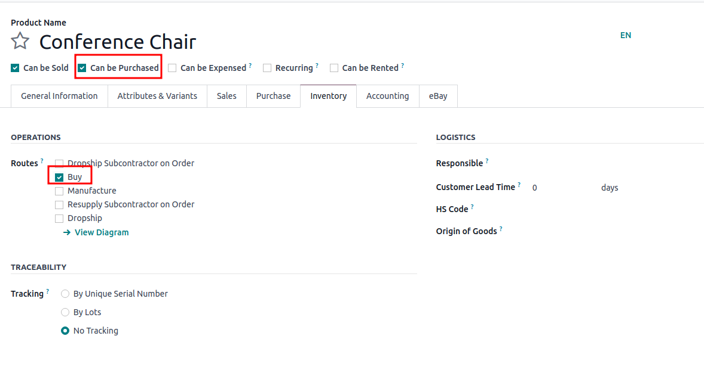
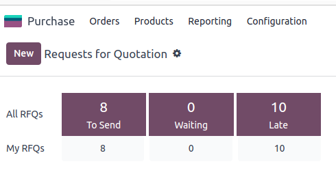

======================
Requests for quotation
======================

.. _inventory/purchase/manage_deals/request_for_quotation:

.. |PO| replace:: :abbr:`PO (Purchase Order)`
.. |POs| replace:: :abbr:`POs (Purchase Orders)`
.. |RFQ| replace:: :abbr:`RFQ (Request for Quotation)`
.. |RFQs| replace:: :abbr:`RFQs (Requests for Quotation)`

Odoo’s requests for quotation (RFQs) feature in the **Purchase** app standardizes
ordering products from multiple vendors with varying prices and delivery times.

|RFQs| are documents companies send to vendors request product pricing. In Odoo, once the vendor
approves the |RFQ|, the purchase order (PO) is confirmed to align on lead times and pricing.

Configuration
=============

Product
-------

To auto-populate product information and prices on an |RFQ|, configure products by going to
:menuselection:`Purchase app --> Products --> Products`. Select an existing product, or create a
new one by selecting :guilabel:`New`. Doing so opens the product form, where various sales and
purchasing data can be configured.

To configure purchasable products, tick the :guilabel:`Can be purchased` checkbox, under the product
name. Then, go to the the :guilabel:`Inventory tab` and enable the **Buy** route.

Vendor pricelist
----------------

In the :guilabel:`Purchase` tab, input the vendor and their price to have this information
auto-populate on an |RFQ| each time the product is listed. Default columns include
:guilabel:`Quantity` :guilabel:`Price`, and :guilabel:`Delivery Lead Time`, but columns like
:guilabel:`Product Variant` (if the product has several options) or :guilabel:`Discounts` can also
be enabled. To enable or disable columns, click on the
:icon:`oi-settings-adjust` :guilabel:`(settings adjust)` icon on the right side of the header row
to make visible or invisible various fields in the vendor pricelist.

.. note::
   Alternatively, prices and delivery lead times for existing products can be added in bulk by
   going to :menuselection:`Purchase app --> Configuration --> Vendor Pricelists`. Click
   :guilabel:`New` on the top left. Under the vendor column, add the product information as it
   pertains to the vendor.

Order products
==============

With products and prices configured, follow these steps to create and send |RFQs| to make purchases
for the company.

|RFQ| dashboard
---------------

To get started, navigate to :menuselection:`Purchase app --> Orders --> Requests for Quotation`.
The |RFQ| dashboard displays an overview of the company’s |RFQs|, |POs|, and their status. The top
of the screen breaks down all |RFQs| in the company as well as individual ones (where the user is
the buyer) with a summary of their status. The top right corner also provides a quick report of the
company’s recent purchases by total value, lead times, and number of |RFQs| sent.

The |RFQ| dashboard displays an overview of the company's |RFQs| and |POs|, including their
statuses. Additionally, the dashboard includes buttons for:

:guilabel:`To Send`: Orders in the |RFQ| stage that have not been sent to vendor.

:guilabel:`Waiting`: |RFQs| that have been sent by email and are waiting on vendor confirmation.

:guilabel:`Late`: |RFQs| or |POs| where the :guilabel:`Order Deadline` has passed.

Filter and view options (e.g., Reference Number, Date, Vendor, etc.) allow toggling between
different views to quickly sort and find orders. Just like in Odoo’s other apps, Filters and Groups
can be customized in the search bar at the top of the page.

Create new |RFQ|
----------------

To create a new |RFQ|, click the :guilabel:`New` button on the top left corner of the screen. A |PO|
number will automatically be assigned to this new |RFQ|. From here, assign the :guilabel:`Vendor` and
:guilabel:`Order Deadline`, the date by which the vendor must confirm their agreement to supply the
products.

.. note::
   After the :guilabel:`Order Deadline` is exceeded, the |RFQ| will be marked as late, but the
   products can still be ordered.

Additional fields
~~~~~~~~~~~~~~~~~

:guilabel:`Vendor Reference` points to the sales and delivery order numbers sent by the vendor.
This will come in handy once products are received and the |PO| needs to be matched to the delivery
order.

Under :guilabel:`Agreement`, blanket orders are long-term purchase agreements on recurring orders
with set pricing. To view and configure blanket orders, head to
:menuselection:`Purchase app --> Orders --> Purchase agreements`.

:guilabel:`Currency` can be changed if purchasing products from a vendor in another country.
To change the main currency or enable additional currencies, head to
:menuselection:`Configuration --> Settings --> Currencies`.

With the :doc:`Storage Locations feature
<../../inventory/warehouses_storage/inventory_management/use_locations>` activated,
the :guilabel:`Deliver to` field becomes available to provides options for the order shipment.
Select the receiving warehouse address here, or select :guilabel:`Dropship` to indicate that this
order is to be shipped directly to the end customer. When :guilabel:`Dropship` is selected, the
:guilabel:`Dropship address` field is enabled. Contact names will populate here from the
**Contacts** app.

:guilabel:`Expected Arrival` is automatically calculated based on the :guilabel:`Order Deadline`
and vendor lead time. Click the checkbox for :guilabel:`Ask confirmation` to ask for signage at
delivery.

In the products tab, add the products to be ordered. Select :guilabel:`Add a product` and start
typing in the product name to select the item from the drop-down menu. :guilabel:`Catalog` can also
be selected to navigate to a products menu under the chosen vendor. From here, products can be
added to the cart. To create a new product and add it, begin by typing the product name, select the
:guilabel:`Create [product name]` and manually add the unit price.

.. note::
  To make adjustments to products and prices, access the product form by clicking the
  :icon:`oi-arrow-right` :guilabel:`(right arrow)` icon that becomes available upon hovering over
  the product name.

Send |RFQ|
----------

There are a few options on how to send an |RFQ| to vendors:

:guilabel:`Send by Email` automatically loads an RFQ template email to send to the vendor’s email
address (configured in the **Contacts** app). After crafting the desired message, click
:guilabel:`Send`. Once the email has been sent, the |RFQ| moves to the :guilabel:`RFQ Sent` stage.

:guilabel:`Print RFQ` downloads a PDF version of the |RFQ|.

Confirm order
-------------

Clicking :guilabel:`Confirm Order` directly transforms the |RFQ| into an active order.

.. tip::
   Odoo tracks communications on each order through the chatter screen on the right. This shows
   the emails sent between the user and the contact, as well as any internal notes and activities.
   Messages, notes, and activities can also be logged on chatter.

Once an |RFQ| is confirmed, it creates a |PO|. Products have been ordered!

On the new |PO|, the :guilabel:`Order Deadline` turns into :guilabel:`Confirmation Date`, which
displays the date and time the user confirmed the order.

Depending on the user's chosen configuration in the **Purchase** app settings, a *vendor bill* is
created once products have been ordered or received. For more information on managing vendor bills,
refer to :doc:`this documentation <manage>`.

.. note::
   After an order is placed, clicking :guilabel:`Receive Products` records the reception of new
   products into the database.

.. note::
   With the **Inventory** app installed, confirming a *PO* automatically creates a receipt document,
   with the product information and expected arrival dates automatically populated.

.. seealso::
   :doc:`manage`

